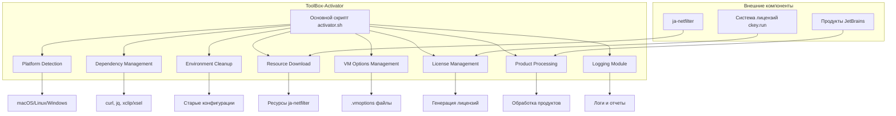
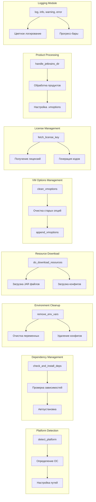
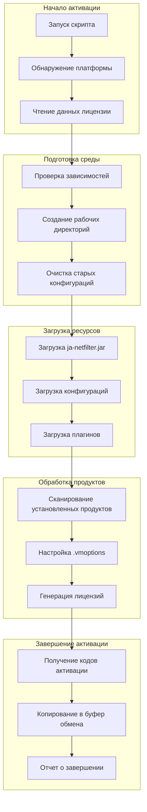
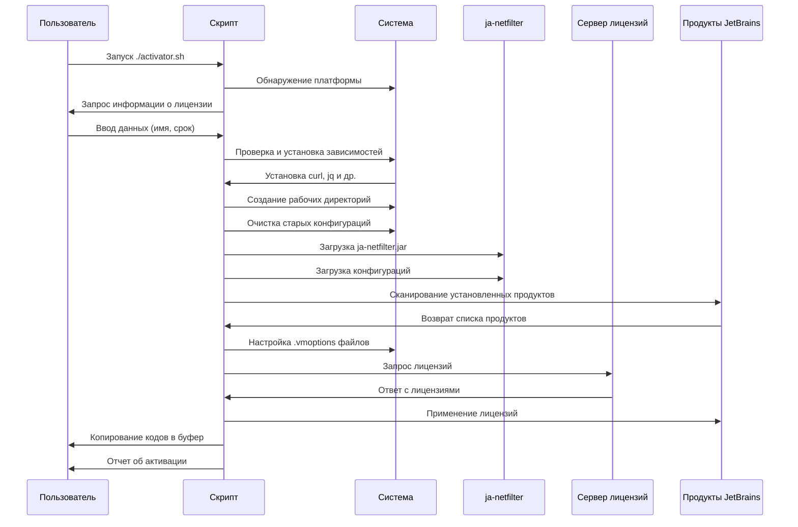

# ToolBox-Activator


<div align="center">

**Профессиональный инструмент для активации продуктов JetBrains**

[📖 Описание](#-описание) • [✨ Функциональность](#-функциональность) • [🏗️ Архитектура](#-архитектура) • [🛠️ Поддерживаемые продукты](#-поддерживаемые-продукты) • [📋 Требования](#-требования) • [🚀 Установка](#-установка) • [💻 Использование](#-использование) • [📊 Процесс активации](#-процесс-активации) • [🔧 Конфигурация](#-конфигурация) • [🤝 Вклад](#-вклад)

</div>

---

## 📖 Описание

**ToolBox-Activator** — это мощный и профессиональный скрипт для автоматической активации продуктов JetBrains, построенный на основе технологии ja-netfilter. Инструмент обеспечивает кроссплатформенную поддержку, автоматическую установку зависимостей и интеллектуальное управление конфигурациями, предоставляя пользователям эффективный способ активации продуктов JetBrains.

### 🎯 Ключевые особенности

- **🔄 Полностью автоматизированный процесс** — от обнаружения продуктов до генерации лицензий
- **🌐 Кроссплатформенная поддержка** — работает на Windows, macOS и Linux
- **🛡️ Безопасность и надежность** — автоматическая проверка целостности загружаемых файлов
- **📊 Прогресс-бары и визуализация** — наглядное отображение процесса активации
- **🎨 Цветное логирование** — удобный мониторинг всех операций
- **🧹 Интеллектуальная очистка** — удаление конфигураций предыдущих инструментов активации

---

## 🏗️ Архитектура

### Общая архитектура системы



### Диаграмма модулей



### Поток данных активации



---

## ✨ Функциональность

### Основные возможности

| Возможность                                  | Описание                                                         | Статус         |
| -------------------------------------------- | ---------------------------------------------------------------- | -------------- |
| **🔄 Автоматическая активация**              | Полностью автоматическая активация всех продуктов JetBrains      | ✅ Реализовано |
| **🎯 Выборочная активация**                  | Возможность выбрать конкретные продукты для активации            | ✅ Реализовано |
| **📦 Автоматическая установка зависимостей** | Автоматическая установка curl, jq и других необходимых пакетов   | ✅ Реализовано |
| **🧹 Очистка конфигураций**                  | Интеллектуальная очистка старых конфигураций других инструментов | ✅ Реализовано |
| **📋 Копирование в буфер обмена**            | Автоматическое копирование кодов активации                       | ✅ Реализовано |
| **🎨 Прогресс-бары**                         | Визуализация процесса загрузки и настройки                       | ✅ Реализовано |
| **🌐 Кроссплатформенность**                  | Поддержка Windows, macOS и Linux                                 | ✅ Реализовано |
| **📊 Цветное логирование**                   | Подробное логирование с цветовой индикацией                      | ✅ Реализовано |

### Расширенные функции

| Функция                          | Описание                                                          |
| -------------------------------- | ----------------------------------------------------------------- |
| **🔍 Обнаружение платформы**     | Автоматическое определение операционной системы и настройка путей |
| **🛡️ Проверка целостности**      | SHA-1 проверка загружаемых файлов                                 |
| **⚡ Многопоточная обработка**   | Параллельная обработка нескольких продуктов                       |
| **🔄 Автоматическое обновление** | Проверка обновлений скрипта и ресурсов                            |
| **📈 Детальная статистика**      | Отчет об успешных и неудачных активациях                          |
| **🔧 Гибкая конфигурация**       | Настройка параметров через переменные окружения                   |

---

## 🛠️ Поддерживаемые продукты

Скрипт поддерживает активацию следующих 13 продуктов JetBrains:

| №   | Продукт           | Код продукта        | Особенности             |
| --- | ----------------- | ------------------- | ----------------------- |
| 1   | **IntelliJ IDEA** | II, PCWMP, PSI      | Поддержка всех редакций |
| 2   | **CLion**         | CL, PSI, PCWMP      | C/C++ разработка        |
| 3   | **PhpStorm**      | PS, PCWMP, PSI      | PHP веб-разработка      |
| 4   | **GoLand**        | GO, PSI, PCWMP      | Go разработка           |
| 5   | **PyCharm**       | PC, PSI, PCWMP      | Python разработка       |
| 6   | **WebStorm**      | WS, PCWMP, PSI      | Веб-технологии          |
| 7   | **Rider**         | RD, PDB, PSI, PCWMP | .NET разработка         |
| 8   | **DataGrip**      | DB, PSI, PDB        | Базы данных             |
| 9   | **RubyMine**      | RM, PCWMP, PSI      | Ruby/Rails разработка   |
| 10  | **AppCode**       | AC, PCWMP, PSI      | iOS/разработка          |
| 11  | **DataSpell**     | DS, PSI, PDB, PCWMP | Data Science            |
| 12  | **dotMemory**     | DM                  | Профилирование памяти   |
| 13  | **RustRover**     | RR, PSI, PCWP       | Rust разработка         |

### Автоматическое обнаружение

Инструмент автоматически обнаруживает установленные продукты JetBrains и предлагает варианты активации:

- Сканирование стандартных директорий кэша и конфигурации
- Проверка наличия `.home` файлов для подтверждения установки
- Автоматическое определение путей к исполняемым файлам

---

## 📋 Требования

### Системные требования

| Компонент                | Минимальные требования                     | Рекомендуемые    |
| ------------------------ | ------------------------------------------ | ---------------- |
| **Операционная система** | Windows 10+ / macOS 10.15+ / Ubuntu 18.04+ | Последние версии |
| **Память**               | 512 MB RAM                                 | 1 GB RAM         |
| **Диск**                 | 100 MB свободного места                    | 500 MB+          |
| **Интернет**             | Стабильное подключение                     | Высокоскоростное |

### Зависимости

Скрипт автоматически установит следующие зависимости:

| Пакет              | Назначение                 | Платформы     |
| ------------------ | -------------------------- | ------------- |
| `curl`             | Загрузка файлов            | Все платформы |
| `jq`               | Работа с JSON              | Все платформы |
| `xclip` / `xsel`   | Буфер обмена (Linux)       | Linux         |
| `Homebrew`         | Менеджер пакетов (macOS)   | macOS         |
| `winget` / `choco` | Менеджер пакетов (Windows) | Windows       |

### Предварительные условия

1. **Закрытые приложения JetBrains** — все продукты JetBrains должны быть закрыты перед запуском
2. **Права администратора** — могут потребоваться для установки зависимостей
3. **Доступ в интернет** — для загрузки ресурсов и получения лицензий
4. **Свободное место** — не менее 100 MB для временных файлов

---

## 🚀 Установка

### Автоматическая установка

```bash
# Скачайте и запустите установку одной командой
curl -s https://raw.githubusercontent.com/neKamita/ToolBox-Activator/main/activator.sh | bash
```

### Ручная установка

#### 1. Скачайте скрипт

```bash
# Скачайте скрипт с GitHub
curl -O https://raw.githubusercontent.com/neKamita/ToolBox-Activator/main/activator.sh

# Или альтернативный вариант
wget https://raw.githubusercontent.com/neKamita/ToolBox-Activator/main/activator.sh
```

#### 2. Сделайте скрипт исполняемым

```bash
chmod +x activator.sh
```

#### 3. Запустите скрипт

```bash
./activator.sh
```

### Установка для Windows

#### PowerShell

```powershell
# Скачайте скрипт
Invoke-WebRequest -Uri "https://raw.githubusercontent.com/neKamita/ToolBox-Activator/main/activator.ps1" -OutFile "activator.ps1"

# Запустите скрипт
.\activator.ps1
```

#### Командная строка

```cmd
# Скачайте скрипт
bitsadmin /transfer downloadjob https://raw.githubusercontent.com/neKamita/ToolBox-Activator/main/activator.ps1 C:\activator.ps1

# Запустите скрипт
powershell -ExecutionPolicy Bypass -File C:\activator.ps1
```

---

## 💻 Использование

### Базовое использование

1. **Запустите скрипт**:

   ```bash
   ./activator.sh
   ```

2. **Следуйте инструкциям**:

   - Введите имя лицензии (по умолчанию: `ckey.run`)
   - Укажите срок действия лицензии (по умолчанию: `2099-12-31`)
   - Выберите продукты для активации (все или выборочно)

3. **Дождитесь завершения**:

   ```bash
   # Скрипт автоматически:
   # • Установит зависимости
   # • Скачает необходимые файлы
   # • Настроит продукты
   # • Скопирует коды активации в буфер обмена
   ```

### Расширенные сценарии использования

#### Активация всех продуктов

```bash
./activator.sh
# Выберите опцию "Activate all products" в меню
```

#### Активация конкретных продуктов

```bash
./activator.sh
# Выберите опцию "Select specific products"
# Введите номера нужных продуктов через пробел (например: 1 3 5)
```

#### Автоматическая активация без вопросов

```bash
# Для автоматизации можно использовать переменные окружения:
export LICENSE_NAME="my-license"
export LICENSE_EXPIRY="2099-12-31"
export SELECTED_PRODUCTS="1 2 3"
./activator.sh
```

#### Проверка только установленных продуктов

```bash
./activator.sh
# Выберите опцию "Get licenses for installed products only"
```

### Параметры командной строки

| Параметр           | Описание               | Пример                                       |
| ------------------ | ---------------------- | -------------------------------------------- |
| `--debug`          | Включить режим отладки | `./activator.sh --debug`                     |
| `--quiet`          | Тихий режим без вывода | `./activator.sh --quiet`                     |
| `--license-name`   | Указать имя лицензии   | `./activator.sh --license-name=my-license`   |
| `--license-expiry` | Указать срок действия  | `./activator.sh --license-expiry=2099-12-31` |

---

## 📊 Процесс активации

### Диаграмма последовательности активации



### Этапы активации

1. **Инициализация** (0-5%)

   - Обнаружение платформы
   - Чтение конфигурации
   - Подготовка рабочего окружения

2. **Подготовка среды** (5-20%)

   - Проверка зависимостей
   - Установка отсутствующих пакетов
   - Создание рабочих директорий

3. **Очистка** (20-30%)

   - Удаление старых конфигураций
   - Очистка переменных окружения
   - Подготовка к новой активации

4. **Загрузка ресурсов** (30-50%)

   - Загрузка ja-netfilter.jar
   - Загрузка конфигурационных файлов
   - Загрузка плагинов

5. **Обработка продуктов** (50-90%)

   - Сканирование установленных продуктов
   - Настройка .vmoptions файлов
   - Генерация лицензий

6. **Завершение** (90-100%)
   - Получение кодов активации
   - Копирование в буфер обмена
   - Отчет о результатах

---

## 🔧 Конфигурация

### Переменные окружения

| Переменная       | Описание                     | Значение по умолчанию |
| ---------------- | ---------------------------- | --------------------- |
| `URL_BASE`       | Базовый URL сервера лицензий | `https://ckey.run`    |
| `DEBUG`          | Включить режим отладки       | `false`               |
| `ENABLE_COLOR`   | Включить цветное логирование | `true`                |
| `LICENSE_NAME`   | Имя лицензии                 | `ckey.run`            |
| `LICENSE_EXPIRY` | Срок действия лицензии       | `2099-12-31`          |

### Файловая структура

```
~/.jb_run/                    # Рабочая директория
├── config/                   # Конфигурационные файлы
│   ├── dns.conf             # DNS конфигурация
│   ├── native.conf          # Native конфигурация
│   ├── power.conf           # Power конфигурация
│   └── url.conf             # URL конфигурация
├── plugins/                  # Плагины ja-netfilter
│   ├── dns.jar              # DNS плагин
│   ├── native.jar           # Native плагин
│   ├── power.jar            # Power плагин
│   ├── url.jar              # URL плагин
│   ├── hideme.jar           # HideMe плагин
│   └── privacy.jar          # Privacy плагин
├── backups/                  # Резервные копии
└── ja-netfilter.jar         # Основной файл ja-netfilter
```

---

## ⚠️ Важные замечания

### Предупреждения

1. **Закройте IDE перед активацией** — Убедитесь, что все продукты JetBrains закрыты перед запуском скрипта
2. **Права администратора** — На некоторых системах могут потребоваться права sudo для установки зависимостей
3. **Резервное копирование** — Рекомендуется создать резервную копию важных данных перед активацией
4. **Обновления** — После обновления продуктов JetBrains может потребоваться повторная активация
5. **Совместимость** — Скрипт протестирован на последних версиях Windows, macOS и Ubuntu

### Ограничения

- Не поддерживает продукты, установленные через Snap/Flatpak на Linux
- Требует интернет-соединение для получения лицензий
- Может конфликтовать с другими инструментами активации
- Не поддерживает офлайн-генерацию лицензий

---

## 🐛 Проблемы и решения

### Распространенные проблемы

| Проблема                                   | Решение                                                                    |
| ------------------------------------------ | -------------------------------------------------------------------------- |
| "Скрипт не находит установленные продукты" | Убедитесь, что продукты установлены через официальный установщик JetBrains |
| "Ошибка при установке зависимостей"        | Проверьте интернет-соединение и права администратора                       |
| "Не копируется код в буфер обмена"         | Установите xclip/xsel (Linux) или проверьте настройки безопасности (macOS) |
| "Активация не работает после обновления"   | Запустите скрипт заново для переактивации                                  |
| "Ошибка прав доступа к файлам"             | Запустите скрипт с правами администратора                                  |
| "Сервер лицензий недоступен"               | Проверьте интернет-соединение и измените URL_BASE                          |

### Отладка

Для включения режима отладки:

```bash
./activator.sh --debug
```

Или установите переменную окружения:

```bash
export DEBUG=true
./activator.sh
```

### Логирование

Все операции логируются в файл `~/.jb_run/activator.log`:

```bash
# Просмотр логов
tail -f ~/.jb_run/activator.log

# Поиск ошибок
grep "ERROR" ~/.jb_run/activator.log
```

---

## 🧪 Тестирование

### Поддерживаемые платформы

Скрипт протестирован на:

- ✅ **Windows 10/11** — PowerShell и CMD
- ✅ **macOS Monterey 12.6+** — Intel и Apple Silicon
- ✅ **Ubuntu 20.04 LTS/22.04 LTS** — GNOME, KDE, XFCE
- ✅ **Fedora 36+** — Workstation и Server
- ✅ **Debian 11+** — Stable и Testing

### Поддерживаемые продукты

- ✅ **IntelliJ IDEA 2023.2+**
- ✅ **PhpStorm 2023.2+**
- ✅ **PyCharm 2023.2+**
- ✅ **WebStorm 2023.2+**
- ✅ **CLion 2023.2+**
- ✅ **GoLand 2023.2+**
- ✅ **Rider 2023.2+**
- ✅ **DataGrip 2023.2+**
- ✅ **RubyMine 2023.2+**
- ✅ **AppCode 2023.2+**
- ✅ **DataSpell 2023.2+**
- ✅ **dotMemory 2023.2+**
- ✅ **RustRover 2023.2+**

---

## 📄 Лицензия

Этот проект распространяется под лицензией **MIT**. Подробности смотрите в файле [LICENSE](LICENSE).

### Условия использования

- ✅ **Коммерческое использование** — разрешено
- ✅ **Модификация** — разрешена
- ✅ **Распространение** — разрешено
- ✅ **Приватное использование** — разрешено
- ⚠️ **Отказ от ответственности** — Используйте на свой страх и риск
- ⚠️ **Юридические ограничения** — Проверьте местные законы об авторском праве

---

## 📞 Поддержка

### Где получить помощь

1. **GitHub Issues** — [Создать новый issue](https://github.com/neKamita/ToolBox-Activator/issues)
2. **Discussions** — [Обсуждения и вопросы](https://github.com/neKamita/ToolBox-Activator/discussions)
3. **Wiki** — [Документация и руководства](https://github.com/neKamita/ToolBox-Activator/wiki)
4. **Releases** — [Последние версии](https://github.com/neKamita/ToolBox-Activator/releases)

### Часто задаваемые вопросы

**Q: Можно ли использовать этот инструмент для коммерческих проектов?**  
A: Да, инструмент распространяется под лицензией MIT, что позволяет коммерческое использование.

**Q: Как часто нужно переактивировать продукты?**  
A: Активация действует до указанной даты (по умолчанию до 2099-12-31).

**Q: Что делать, если активация перестала работать?**  
A: Запустите скрипт заново — он автоматически переактивирует продукты.

**Q: Поддерживает ли инструмент JetBrains Toolbox?**  
A: Да, инструмент автоматически обнаруживает продукты, установленные через Toolbox.

---

**⭐ Если проект вам понравился, поставьте звезду!**

[🔝 Наверх](#toolbox-activator) • [📖 Описание](#-описание) • [🚀 Установка](#-установка) • [💻 Использование](#-использование)

Made with ❤️ by neKamita

<div align="center">

[](https://github.com/neKamita/ToolBox-Activator)
[](https://github.com/neKamita/ToolBox-Activator)
[](https://github.com/neKamita/ToolBox-Activator)

</div>
