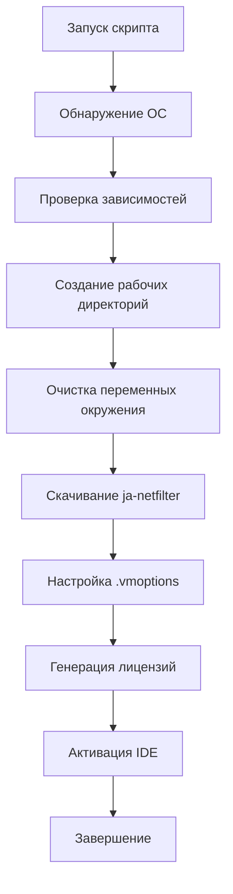
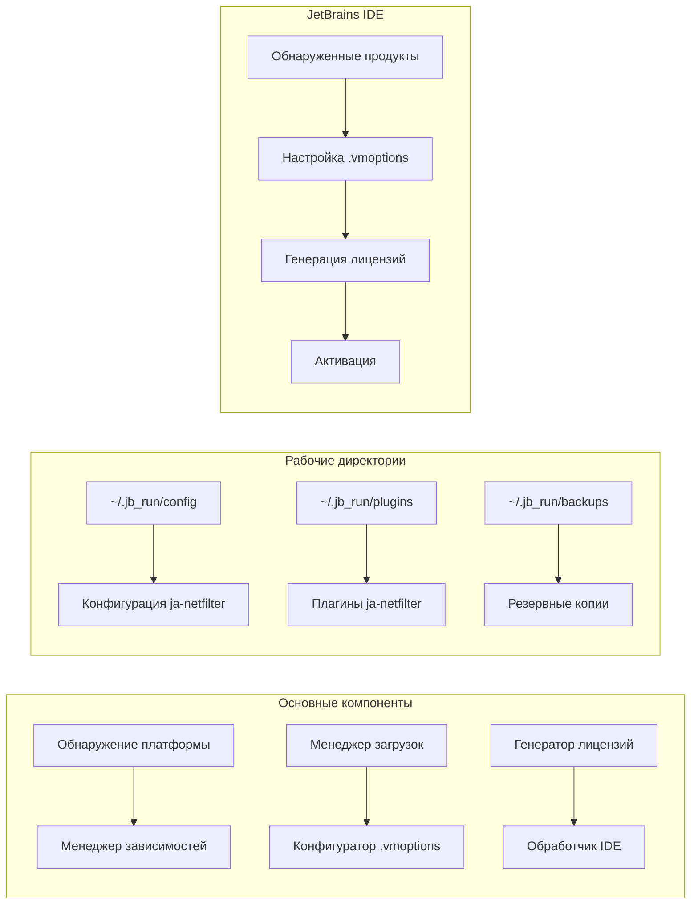
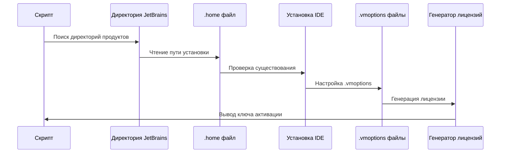

<div align="center">

# 🚀 ToolBox Activator


---

### 🎯 Универсальный активатор для всех JetBrains IDE

**Автоматическая активация всех JetBrains IDE с помощью ja-netfilter**

[📖 Инструкция](#-установка-и-использование) • [🔧 Возможности](#-возможности) • [💻 Поддерживаемые IDE](#-поддерживаемые-ide) • [🛠️ Как это работает](#-как-это-работает)

</div>

---

```ascii
JJJJJJ   EEEEEEE   TTTTTTTT  BBBBBBB    RRRRRR    AAAAAA    IIIIIIII  NNNN   NN   SSSSSS
   JJ    EE           TT     BB    BB   RR   RR   AA  AA       II     NNNNN  NN  SS
   JJ    EE           TT     BB    BB   RR   RR   AA  AA       II     NN NNN NN   SS
   JJ    EEEEE        TT     BBBBBBB    RRRRRR    AAAAAA       II     NN  NNNNN    SSSSS
   JJ    EE           TT     BB    BB   RR   RR   AA  AA       II     NN   NNNN         SS
JJ JJ    EE           TT     BB    BB   RR   RR   AA  AA       II     NN    NNN          SS
 JJJJ    EEEEEEE      TT     BBBBBBB    RR   RR   AA  AA    IIIIIIII  NN    NNN    SSSSSS
```

## 📝 Описание

ToolBox Activator — это мощный и удобный инструмент для автоматической активации всех установленных JetBrains IDE. Скрипт работает на Windows, macOS и Linux, автоматически обнаруживает установленные продукты, скачивает необходимые компоненты ja-netfilter и генерирует лицензионные ключи.

---

## ✨ Возможности

- 🚀 **Быстрая активация** - активирует все установленные JetBrains IDE одной командой
- 🔄 **Автоматическое обнаружение** - находит все установленные продукты автоматически
- 🌐 **Мультиплатформенность** - поддержка Windows, macOS и Linux
- 📦 **Автоматическая установка зависимостей** - устанавливает curl и jq при необходимости
- 🧹 **Очистка переменных окружения** - удаляет следы предыдущих активаторов
- 💾 **Резервное копирование** - создает бэкапы перед изменением конфигурации
- 🔧 **Гибкая настройка** - возможность указать имя лицензии и срок действия
- 🛡️ **Безопасность** - проверка SHA-1 хэшей загруженных файлов
- 🎯 **Удобный интерфейс** - цветной вывод и прогресс-бары

---

## 💻 Поддерживаемые IDE

| IDE                  | Поддержка            | Поддержка |
| -------------------- | -------------------- | --------- |
| 🎨 **IntelliJ IDEA** | Ultimate & Community | ✅ Полная |
| ⚙️ **CLion**         | C/C++ IDE            | ✅ Полная |
| 🐘 **PhpStorm**      | PHP IDE              | ✅ Полная |
| 🎯 **GoLand**        | Go IDE               | ✅ Полная |
| 🐍 **PyCharm**       | Python IDE           | ✅ Полная |
| 🌐 **WebStorm**      | Web Frontend IDE     | ✅ Полная |
| 🎮 **Rider**         | .NET IDE             | ✅ Полная |
| 🗄️ **DataGrip**      | SQL IDE              | ✅ Полная |
| 💎 **RubyMine**      | Ruby IDE             | ✅ Полная |
| 🍎 **AppCode**       | iOS/macOS IDE        | ✅ Полная |
| 🔮 **DataSpell**     | Data Science IDE     | ✅ Полная |
| 🔍 **dotMemory**     | Memory Profiler      | ✅ Полная |
| 🦀 **RustRover**     | Rust IDE             | ✅ Полная |

---

## 🛠️ Установка и Использование

### 📋 Предварительные требования

- **Windows**: PowerShell 5.1+
- **macOS**: Bash/Zsh
- **Linux**: Bash
- **Интернет-соединение** для скачивания файлов

### 🚀 Быстрый старт

#### Windows (PowerShell)

```powershell
# Скачайте и запустите скрипт
Invoke-WebRequest -Uri "https://raw.githubusercontent.com/neKamita/toolbox-activator/main/activate.ps1" -OutFile "activate.ps1"
Set-ExecutionPolicy -ExecutionPolicy RemoteSigned -Scope Process
.\activate.ps1
```

#### macOS/Linux (Bash)

```bash
# Скачайте и запустите скрипт
curl -o activate.sh https://raw.githubusercontent.com/neKamita/toolbox-activator/main/activate.sh
chmod +x activate.sh
./activate.sh
```

### 📝 Пошаговая инструкция

1. **Скачайте скрипт** соответствующий вашей ОС
2. **Дайте права на исполнение** (для Linux/macOS):
   ```bash
   chmod +x activate.sh
   ```
3. **Запустите скрипт**:
   ```bash
   ./activate.sh  # Linux/macOS
   # или
   .\activate.ps1  # Windows
   ```
4. **Следуйте инструкциям** в консоли:
   - Введите имя лицензии (по умолчанию: `ckey.run`)
   - Укажите срок действия лицензии (по умолчанию: `2099-12-31`)
5. **Дождитесь завершения** активации всех продуктов
6. **Скопируйте лицензионные ключи** из вывода скрипта

---

## 📹 Видео инструкции

Посмотрите подробную видео инструкцию по установке и использованию ToolBox Activator:

<div align="center">

🎬 **[Смотреть видео инструкцию](Instructions.mp4)**

> **Примечание:** Видео содержит подробную пошаговую демонстрацию процесса активации JetBrains IDE с объяснениями всех этапов и нюансов установки.

**📋 Что содержит видео:**
- Полная установка ToolBox Activator
- Пошаговая настройка для вашей ОС
- Активация всех JetBrains IDE
- Решение частых проблем
- Советы по использованию

---

## 🎥 Демонстрация

<div align="center">
  <a href="Instructions.mp4">
    
  </a>
  <p><em>Нажмите на изображение, чтобы посмотреть видео инструкцию</em></p>
</div>

</div>

---

## 🔧 Как это работает

### Процесс активации



### Архитектура скрипта



### Поток обработки IDE



---

## 🖥️ Поддерживаемые платформы

| Платформа      | Версия        | Поддержка    | Особенности           |
| -------------- | ------------- | ------------ | --------------------- |
| 🪟 **Windows** | 10/11         | ✅ Полная    | PowerShell 5.1+       |
| 🪟 **Windows** | 8.1           | ✅ Частичная | PowerShell 5.0        |
| 🍎 **macOS**   | Big Sur+      | ✅ Полная    | Apple Silicon/Intel   |
| 🍎 **macOS**   | Catalina      | ✅ Полная    | Intel процессоры      |
| 🐧 **Linux**   | Ubuntu 20.04+ | ✅ Полная    | apt/dnf/yum/pacman    |
| 🐧 **Linux**   | Debian 11+    | ✅ Полная    | apt пакетный менеджер |
| 🐧 **Linux**   | Fedora 35+    | ✅ Полная    | dnf/yum               |
| 🐧 **Linux**   | Arch Linux    | ✅ Полная    | pacman                |

---

## 🚨 Важные замечания

1. **Закройте все JetBrains IDE** перед запуском скрипта
2. **Сохраните важные проекты** перед активацией
3. **Сделайте бэкап** важных данных
4. **Используйте на свой страх и риск**
5. **Скрипт активирует ВСЕ продукты**, независимо от предыдущей активации

---

## ⚠️ Troubleshooting

### Частые проблемы и решения

#### 1. "Скрипт не запускается"

**Проблема**: Нет прав на исполнение или политика выполнения

**Решение**:

```bash
# Linux/macOS
chmod +x activate.sh

# Windows PowerShell
Set-ExecutionPolicy -ExecutionPolicy RemoteSigned -Scope Process
```

#### 2. "Не найдены JetBrains IDE"

**Проблема**: IDE не установлены или не обнаружены

**Решение**:

- Убедитесь, что JetBrains IDE установлены
- Проверьте пути в `~/.config/JetBrains` (Linux/macOS) или `%APPDATA%\JetBrains` (Windows)
- Запустите IDE хотя бы один раз для создания конфигурации

#### 3. "Ошибка скачивания файлов"

**Проблема**: Проблемы с сетью или недоступность сервера

**Решение**:

- Проверьте интернет-соединение
- Попробуйте запустить скрипт позже
- Проверьте доступность `https://ckey.run`

#### 4. "Лицензионные ключи не работают"

**Проблема**: Некорректные ключи или блокировка сервера

**Решение**:

- Убедитесь, что скопировали ключи полностью
- Проверьте формат активации в JetBrains IDE
- Попробуйте создать новую лицензию с другими параметрами

#### 5. "Ошибка .vmoptions файлов"

**Проблема**: Проблемы с правами доступа или существующими настройками

**Решение**:

- Запустите скрипт от имени администратора
- Проверьте права доступа к файлам .vmoptions
- Скрипт автоматически создаст резервные копии

---

## 🔐 Лицензия и Безопасность

### 📄 Лицензия MIT

Этот проект распространяется под лицензией MIT. Подробности смотрите в файле [LICENSE](LICENSE).

### 🛡️ Безопасность

- **SHA-1 проверка** - все загруженные JAR файлы проверяются на целостность
- **HTTPS протокол** - все файлы скачиваются через защищенное соединение
- **Локальная обработка** - генерация лицензий происходит локально
- **Резервное копирование** - все изменения сохраняются в бэкапах

### ⚠️ Предупреждения

- Используйте скрипт на свой страх и риск
- Автор не несет ответственности за возможные последствия
- Рекомендуется использовать в тестовой среде
- Возможно блокировка лицензий со стороны JetBrains

---

## 🤝 Contributing

Мы приветствуем вклад в развитие проекта! Вот как вы можете помочь:

### 📝 Как внести вклад

1. **Форкните репозиторий** 🍴
2. **Создайте ветку** для вашей фичи: `git checkout -b feature/AmazingFeature`
3. **Зафиксируйте изменения** 📦: `git commit -m 'Add some AmazingFeature'`
4. **Отправьте в ветку** 🚀: `git push origin feature/AmazingFeature`
5. **Создайте Pull Request** 📋

### 📋 Требования к PR

- Код должен соответствовать стандартам проекта
- Добавьте тесты для новой функциональности
- Обновите документацию при необходимости
- Проверьте, что все тесты проходят

### 🐛 Сообщить об ошибке

Если вы нашли ошибку, пожалуйста:

1. Проверьте [существующие issues](https://github.com/neKamita/toolbox-activator/issues)
2. Создайте новый issue с подробным описанием
3. Укажите вашу ОС, версию скрипта и шаги воспроизведения

---

## 🙏 Благодарности

- [ja-netfilter](https://gitee.com/ja-netfilter/ja-netfilter) - основная технология активации
- JetBrains - за прекрасные IDE

---

<div align="center">

**⭐ Если вам нравится проект, поставьте звезду!**

[](https://star-history.com/#neKamita/toolbox-activator&Date)

---

Made with ❤️ by [neKamita](https://github.com/neKamita)

</div>
