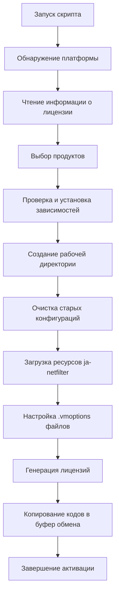
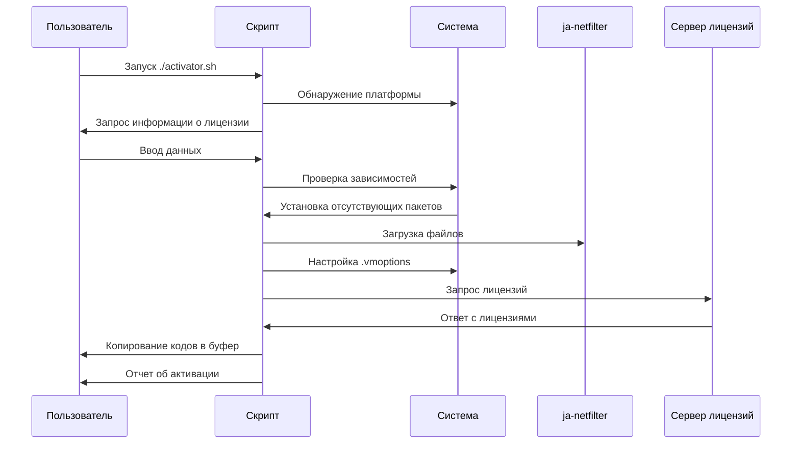
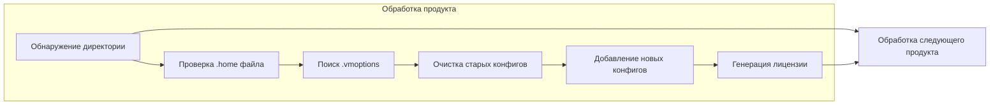

# ToolBox-Activator


<div align="center">

**Профессиональный инструмент для активации продуктов JetBrains**

[📖 Описание](#-описание) • [✨ Функциональность](#-функциональность) • [🛠️ Поддерживаемые продукты](#-поддерживаемые-продукты) • [📋 Требования](#-требования) • [🚀 Установка](#-установка) • [💻 Использование](#-использование) • [📊 Процесс активации](#-процесс-активации) • [🤝 Вклад](#-вклад)

</div>

---

## 📖 Описание

**ToolBox-Activator** — это мощный и удобный скрипт для автоматической активации продуктов JetBrains. Он использует технологию ja-netfilter для обхода системы активации, предоставляя пользователям легкий способ активировать любые продукты JetBrains без необходимости покупки лицензии.

## ✨ Функциональность

| Возможность                       | Описание                                                              |
| --------------------------------- | --------------------------------------------------------------------- |
| 🔄 **Автоматическая активация**   | Активирует все выбранные продукты JetBrains одним скриптом            |
| 🎯 **Выборочная активация**       | Позволяет выбрать конкретные продукты для активации                   |
| 📋 **Автоустановка зависимостей** | Автоматически устанавливает необходимые пакеты (curl, jq, xclip/xsel) |
| 🧹 **Очистка конфигураций**       | Удаляет предыдущие конфигурации других инструментов активации         |
| 📋 **Копирование в буфер обмена** | Автоматически копирует коды активации в буфер обмена                  |
| 🎨 **Прогресс-бар**               | Визуализация процесса загрузки и настройки                            |
| 🌐 **Кроссплатформенность**       | Работает на Windows, macOS и Linux                                    |
| 📊 **Логирование**                | Подробное логирование всех операций для диагностики                   |

---

## 🛠️ Поддерживаемые продукты

Скрипт поддерживает активацию следующих продуктов JetBrains:

| №   | Продукт           | Код продукта        | Статус            |
| --- | ----------------- | ------------------- | ----------------- |
| 1   | **IntelliJ IDEA** | II, PCWMP, PSI      | ✅ Поддерживается |
| 2   | **CLion**         | CL, PSI, PCWMP      | ✅ Поддерживается |
| 3   | **PhpStorm**      | PS, PCWMP, PSI      | ✅ Поддерживается |
| 4   | **GoLand**        | GO, PSI, PCWMP      | ✅ Поддерживается |
| 5   | **PyCharm**       | PC, PSI, PCWMP      | ✅ Поддерживается |
| 6   | **WebStorm**      | WS, PCWMP, PSI      | ✅ Поддерживается |
| 7   | **Rider**         | RD, PDB, PSI, PCWMP | ✅ Поддерживается |
| 8   | **DataGrip**      | DB, PSI, PDB        | ✅ Поддерживается |
| 9   | **RubyMine**      | RM, PCWMP, PSI      | ✅ Поддерживается |
| 10  | **AppCode**       | AC, PCWMP, PSI      | ✅ Поддерживается |
| 11  | **DataSpell**     | DS, PSI, PDB, PCWMP | ✅ Поддерживается |
| 12  | **dotMemory**     | DM                  | ✅ Поддерживается |
| 13  | **RustRover**     | RR, PSI, PCWP       | ✅ Поддерживается |

---

### Необходимые пакеты

Скрипт автоматически установит следующие зависимости:

| Пакет                        | Назначение              | Автоустановка |
| ---------------------------- | ----------------------- | ------------- |
| `curl`                       | Загрузка файлов         | ✅ Да         |
| `jq`                         | Работа с JSON           | ✅ Да         |
| `xclip` / `xsel` (Linux)     | Работа с буфером обмена | ✅ Да         |
| `winget` / `choco` (Windows) | Управление пакетами     | ✅ Да         |

---

## 🚀 Установка

### 1. Скачайте скрипт

```bash
# Скачайте скрипт с GitHub
curl -O https://raw.githubusercontent.com/neKamita/ToolBox-Activator/main/activator.sh

# Или скопируйте вручную
wget https://raw.githubusercontent.com/neKamita/ToolBox-Activator/main/activator.sh
```

### 2. Сделайте скрипт исполняемым

```bash
chmod +x activator.sh
```

### 3. Запустите скрипт

```bash
./activator.sh
```

## 🪟 Windows Installation

### 1. Download the script

111 `powershell
112 Invoke-WebRequest -Uri "https://raw.githubusercontent.com/neKamita/ToolBox-Activator/main/activator.ps1" -OutFile "activator.ps1"
113 `

### 2. Run the script

117 `powershell
118 .\activator.ps1
119 `

---

## 💻 Использование

### Базовое использование

1. **Запустите скрипт**:

   ```bash
   ./activator.sh
   ```

2. **Следуйте инструкциям**:

   - Введите имя лицензии (по умолчанию: ckey.run)
   - Укажите срок действия лицензии (по умолчанию: 2099-12-31)
   - Выберите продукты для активации (все или выборочно)

3. **Дождитесь завершения**:
   - Скрипт автоматически установит зависимости
   - Скачает необходимые файлы
   - Настроит продукты
   - Скопирует коды активации в буфер обмена

### Примеры использования

#### Активация всех продуктов

```bash
./activator.sh
# Выберите опцию "Activate all products" в меню
```

#### Активация конкретных продуктов

```bash
./activator.sh
# Выберите опцию "Select specific products"
# Введите номера нужных продуктов через пробел (например: 1 3 5)
```

#### Автоматическая активация без вопросов

```bash
# Скрипт задаст все необходимые вопросы
# Для автоматизации можно модифицировать скрипт
```

### Примеры использования для Windows

#### Активация всех продуктов

139 `powershell
140 .\activator.ps1
141 # Выберите опцию "Activate all products" в меню
142 `

#### Активация конкретных продуктов

146 `powershell
147 .\activator.ps1
148 # Выберите опцию "Select specific products"
149 # Введите номера нужных продуктов через пробел (например: 1 3 5)
150 `

## 📊 Процесс активации

### Диаграмма процесса активации



### Диаграмма работы скрипта



### Поток обработки продуктов



---

## ⚠️ Важные замечания

1. **Закройте IDE перед активацией** — Убедитесь, что все продукты JetBrains закрыты перед запуском скрипта
2. **Права администратора** — На некоторых системах могут потребоваться права sudo для установки зависимостей
3. **Резервное копирование** — Рекомендуется создать резервную копию важных данных перед активацией
4. **Обновления** — После обновления продуктов JetBrains может потребоваться повторная активация
5. **Совместимость** — Скрипт протестирован на последних версиях Windows, macOS и Ubuntu

---

## 🐛 Проблемы и решения

### Распространенные проблемы

| Проблема                                   | Решение                                                                    |
| ------------------------------------------ | -------------------------------------------------------------------------- |
| "Скрипт не находит установленные продукты" | Убедитесь, что продукты установлены через официальный установщик JetBrains |
| "Ошибка при установке зависимостей"        | Проверьте интернет-соединение и права администратора                       |
| "Не копируется код в буфер обмена"         | Установите xclip/xsel (Linux) или проверьте настройки безопасности (macOS) |
| "Активация не работает после обновления"   | Запустите скрипт заново для переактивации                                  |

### Тестирование

Скрипт протестирован на:

- ✅ Windows 10+ / 11+
- ✅ macOS Monterey 12.6+
- ✅ Ubuntu 20.04 LTS / 22.04 LTS
- ✅ IntelliJ IDEA 2023.2+
- ✅ PhpStorm 2023.2+
- ✅ Другие продукты JetBrains 2023.2+

---

## 🤝 Вклад

Вклад в развитие проекта приветствуется! Вы можете помочь:

1. **Сообщить об ошибке** — Создайте issue в разделе Issues
2. **Предложить улучшение** — Опишите вашу идею в Discussions
3. **Отправить PR** — Внесите изменения и создайте Pull Request
4. **Распространить проект** — Поделитесь ссылкой со знакомыми разработчиками

### Развитие проекта

- 📈 **Планы на будущее**:
  - Улучшение поддержки Windows
  - Веб-интерфейс для управления активациями
  - Интеграция с менеджером пакетов
  - Автоматические обновления скрипта

---

## 📄 Лицензия

Этот проект распространяется под лицензией **MIT**. Подробности смотрите в файле [LICENSE](LICENSE).

---

**⭐ Если проект вам понравился, поставьте звезду!**

[🔝 Наверх](#toolbox-activator) • [📖 Описание](#-описание) • [🚀 Установка](#-установка)

Made with ❤️ by neKamita

</div>
