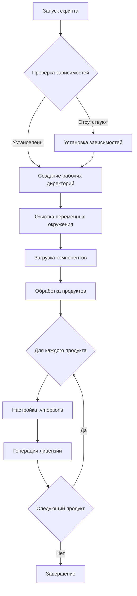
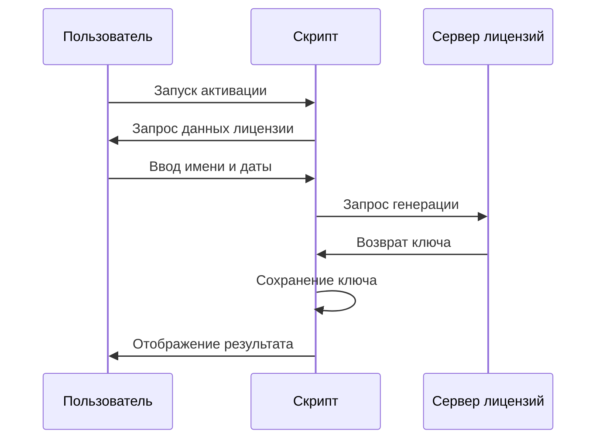
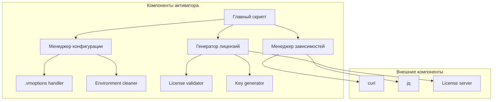

JJJJJJ   EEEEEEE   TTTTTTTT  BBBBBBB    RRRRRR    AAAAAA    IIIIIIII  NNNN   NN   SSSSSS
   JJ    EE           TT     BB    BB   RR   RR   AA  AA       II     NNNNN  NN  SS    
   JJ    EE           TT     BB    BB   RR   RR   AA  AA       II     NN NNN NN   SS    
   JJ    EEEEE        TT     BBBBBBB    RRRRRR    AAAAAA       II     NN  NNNNN    SSSSS
   JJ    EE           TT     BB    BB   RR   RR   AA  AA       II     NN   NNNN         SS
JJ JJ    EE           TT     BB    BB   RR   RR   AA  AA       II     NN    NNN          SS
 JJJJ    EEEEEEE      TT     BBBBBBB    RR   RR   AA  AA    IIIIIIII  NN    NNN    SSSSSS
```

# 🚀 JetBrains Toolbox Activator

Мощный инструмент для активации продуктов JetBrains с поддержкой Windows, Linux и macOS. 

## ✨ Основные возможности

- 🖥️ **Кроссплатформенность** - работает на Windows, Linux и macOS
- 🔧 **Автоматическая установка** зависимостей (curl, jq)
- ⚙️ **Умная настройка** .vmoptions файлов
- 🗝️ **Генерация лицензионных ключей**
- 🧹 **Автоматическая очистка** остатков от других активаторов
- 🛡️ **Резервное копирование** важных файлов перед изменением

## 🔄 Процесс работы



## 🔄 Процесс генерации лицензии



## 🏗️ Архитектура компонентов



## 💻 Требования к системе

### Windows
- PowerShell 5.1 или выше
- Доступ к интернету
- Права администратора (для установки зависимостей)

### Linux/macOS
- Bash
- Доступ к интернету
- Права sudo (для установки зависимостей)

## 📦 Поддерживаемые продукты

| Продукт | Код продукта |
|---------|--------------|
| IntelliJ IDEA | II,PCWMP,PSI |
| CLion | CL,PSI,PCWMP |
| PhpStorm | PS,PCWMP,PSI |
| GoLand | GO,PSI,PCWMP |
| PyCharm | PC,PSI,PCWMP |
| WebStorm | WS,PCWMP,PSI |
| Rider | RD,PDB,PSI,PCWMP |
| DataGrip | DB,PSI,PDB |
| RubyMine | RM,PCWMP,PSI |
| AppCode | AC,PCWMP,PSI |
| DataSpell | DS,PSI,PDB,PCWMP |
| DotMemory | DM |
| RustRover | RR,PSI,PCWP |

## 🚀 Использование

### Windows
```powershell
# Загрузка и запуск скрипта
irm https://ckey.run/windows | iex
```

### Linux/macOS
```bash
# Загрузка и запуск скрипта
curl -fsSL https://ckey.run/unix | bash
```

## ❗ Устранение неполадок

### Проблема: Не устанавливаются зависимости
- Windows: Убедитесь, что установлен winget или Chocolatey
- Linux: Проверьте наличие прав sudo
- macOS: Установите Homebrew вручную

### Проблема: Ошибка при генерации лицензии
- Проверьте подключение к интернету
- Убедитесь в корректности формата даты (YYYY-MM-DD)
- Попробуйте запустить скрипт с правами администратора

### Проблема: IDE не активируется
- Закройте все процессы JetBrains
- Проверьте наличие файла .key в конфигурационной директории
- Убедитесь, что файлы .vmoptions настроены корректно

## 🛡️ Заметки о безопасности

1. Скрипт автоматически создаёт резервные копии изменяемых файлов
2. Все изменения можно откатить, удалив директорию `.jb_run`
3. Скрипт не собирает и не отправляет никакую личную информацию
4. Все операции производятся локально, кроме генерации лицензии

## 📄 Лицензия

Этот проект распространяется под лицензией MIT. Подробности в файле LICENSE.

---
