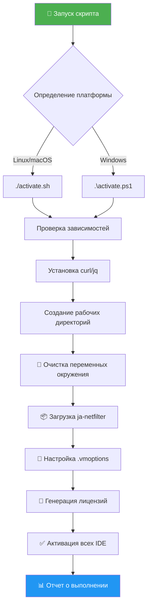
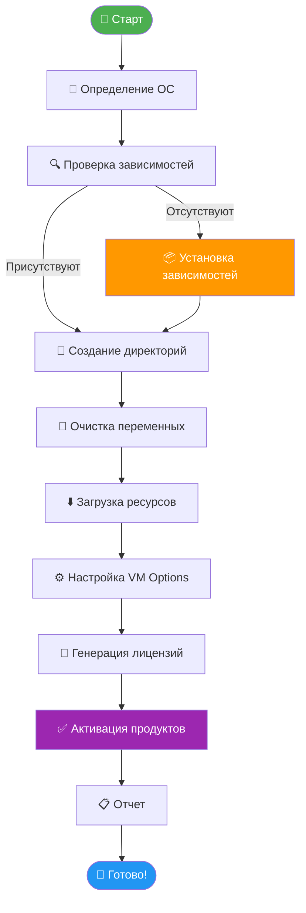
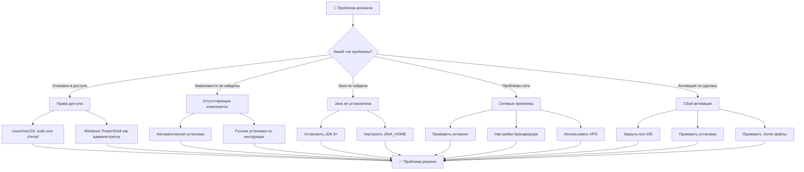

<div align="center">

# 🚀 JetBrains Activation Tool

[](https://opensource.org/licenses/MIT)
[](https://github.com/neKamita/ToolBox-Activator)
[](https://github.com/PowerShell/PowerShell)
[](https://www.gnu.org/software/bash/)

> ✨ **Автоматический инструмент активации** для всех IDE от JetBrains с использованием ja-netfilter

**Надежная активация • Мультиплатформенная поддержка • Простота использования**

[📖 Документация](#-документация) • [🚀 Быстрый старт](#-быстрый-старт) • [🔧 Установка](#-установка) • [🆘 Поддержка](#-поддержка)

</div>

---

## 📋 О проекте

Инструмент автоматической активации для всех IDE от JetBrains, включая IntelliJ IDEA, PyCharm, WebStorm, GoLand и многие другие. Использует современные технологии ja-netfilter для надежной и безопасной активации.

### 🌟 Ключевые возможности

| Функция                         | Описание                                                    |
| ------------------------------- | ----------------------------------------------------------- |
| 🎯 **Автообнаружение**          | Автоматически находит все установленные продукты JetBrains  |
| 🔄 **Мультиплатформа**          | Поддержка Linux, macOS и Windows                            |
| 📦 **Управление зависимостями** | Автоматическая установка curl, jq и других компонентов      |
| 🎫 **Генерация лицензий**       | Создание ключей активации для всех поддерживаемых продуктов |
| 🧹 **Очистка среды**            | Удаление конфликтующих переменных окружения                 |
| 📊 **Отслеживание прогресса**   | Цветной вывод и индикаторы выполнения                       |

### 🎯 Поддерживаемые продукты

| IDE           | Иконка | Статус            |
| ------------- | ------ | ----------------- |
| IntelliJ IDEA | 🧠     | ✅ Поддерживается |
| CLion         | ⚙️     | ✅ Поддерживается |
| PhpStorm      | 🐘     | ✅ Поддерживается |
| GoLand        | 🐹     | ✅ Поддерживается |
| PyCharm       | 🐍     | ✅ Поддерживается |
| WebStorm      | 🌐     | ✅ Поддерживается |
| Rider         | 🐴     | ✅ Поддерживается |
| DataGrip      | 🗄️     | ✅ Поддерживается |
| RubyMine      | 💎     | ✅ Поддерживается |
| AppCode       | 🍎     | ✅ Поддерживается |
| DataSpell     | 📊     | ✅ Поддерживается |
| DotMemory     | 🔍     | ✅ Поддерживается |
| RustRover     | 🦀     | ✅ Поддерживается |

---

## 🏗️ Архитектура системы



### 📊 Процесс выполнения скрипта



---

## 🎯 Быстрый старт

<div align="center">

### Linux/macOS 🐧🍎

```bash
# 1. Скачайте репозиторий
git clone https://github.com/neKamita/ToolBox-Activator.git
cd ToolBox-Activator

# 2. Сделайте скрипт исполняемым
chmod +x activate.sh

# 3. Запустите активацию
./activate.sh
```

### Windows 🖥️

```powershell
# 1. Скачайте репозиторий
git clone https://github.com/neKamita/ToolBox-Activator.git
cd ToolBox-Activator

# 2. Запустите PowerShell от имени администратора
# 3. Выполните активацию
.\activate.ps1
```

</div>

---

## 🔧 Системные требования

<div align="center">

| Платформа      | Требования                      | Статус              |
| -------------- | ------------------------------- | ------------------- |
| **🐧 Linux**   | Bash 4.0+, curl, jq, Java       | ✅ Полная поддержка |
| **🍎 macOS**   | Bash 4.0+, curl, jq, Java       | ✅ Полная поддержка |
| **🖥️ Windows** | PowerShell 5.1+, .NET Framework | ✅ Полная поддержка |

</div>

### 📋 Детальные требования

<details>
<summary><strong>🔍 Развернуть требования</strong></summary>

#### Linux/macOS 🐧🍎

- **Shell**: Bash 4.0 или выше
- **Инструменты**: curl, jq
- **Java**: JDK 8+ (для JetBrains IDE)
- **Сеть**: Интернет-соединение
- **Права**: Доступ на запись в домашнюю директорию

#### Windows 🖥️

- **ОС**: Windows 10 или выше
- **PowerShell**: 5.1 или выше
- **Права**: Администратор (для установки зависимостей)
- **Сеть**: Интернет-соединение
- **Брандмауэр**: Разрешение доступа к внешним ресурсам

</details>

---

## 📦 Установка

<div align="center">

| Шаг | Действие          | Описание                                                                                       |
| --- | ----------------- | ---------------------------------------------------------------------------------------------- |
| 1   | 📥 Скачать        | Клонируйте или загрузите репозиторий                                                           |
| 2   | 📂 Выбрать скрипт | `activate.sh` для Linux/macOS или `activate.ps1` для Windows                                   |
| 3   | ⚙️ Подготовить    | Сделайте скрипт исполняемым (Linux/macOS) или запустите PowerShell как администратор (Windows) |
| 4   | 🚀 Запустить      | Выполните скрипт и следуйте инструкциям                                                        |

</div>

### 📋 Детальная установка

#### Linux/macOS 🐧🍎

1. **📥 Скачайте репозиторий**

   ```bash
   git clone https://github.com/neKamita/ToolBox-Activator.git
   cd ToolBox-Activator
   ```

2. **📂 Подготовьте скрипт**

   ```bash
   chmod +x activate.sh
   ```

3. **🚀 Запустите активацию**
   ```bash
   ./activate.sh
   ```

#### Windows 🖥️

1. **📥 Скачайте репозиторий**

   ```powershell
   git clone https://github.com/neKamita/ToolBox-Activator.git
   cd ToolBox-Activator
   ```

2. **📂 Откройте PowerShell от имени администратора**

   - Найдите PowerShell в меню Пуск
   - Щелкните правой кнопкой → "Запуск от имени администратора"

3. **🚀 Выполните активацию**
   ```powershell
   .\activate.ps1
   ```

---

### 📋 Этапы работы скрипта

<div align="center">

| Этап | Действие                     | Описание                                          |
| ---- | ---------------------------- | ------------------------------------------------- |
| 1    | 🎯 **Определение платформы** | Автоматическое обнаружение ОС                     |
| 2    | 🔍 **Проверка зависимостей** | Поиск curl, jq, Java                              |
| 3    | 📦 **Установка компонентов** | Автоматическая установка недостающих инструментов |
| 4    | 🧹 **Очистка среды**         | Удаление конфликтующих переменных окружения       |
| 5    | ⬇️ **Загрузка ресурсов**     | Скачивание JAR файлов ja-netfilter                |
| 6    | ⚙️ **Настройка VM Options**  | Обновление файлов конфигурации для всех IDE       |
| 7    | 🎫 **Генерация лицензий**    | Создание ключей активации                         |
| 8    | ✅ **Применение активации**  | Активация всех обнаруженных продуктов             |
| 9    | 📊 **Отчет**                 | Вывод результатов и ключей                        |

</div>

### 🎯 Что делает скрипт

- ✅ **Проверяет зависимости** и устанавливает их при необходимости
- ✅ **Создает рабочие директории** в `~/.jb_run` (Linux/macOS) или `%USERPROFILE%\.jb_run` (Windows)
- ✅ **Загружает необходимые JAR файлы** и файлы конфигурации
- ✅ **Очищает существующие переменные окружения**
- ✅ **Настраивает .vmoptions файлы** для всех установленных продуктов JetBrains
- ✅ **Генерирует лицензионные ключи** для каждого продукта
- ✅ **Отображает лицензионные ключи** для ручной активации при необходимости

---

## ⚠️ Важные замечания

> **⚠️ Перед запуском закройте все IDE от JetBrains!**

<div align="center">

| Правило                  | Описание                                    | Иконка |
| ------------------------ | ------------------------------------------- | ------ |
| **Закрыть IDE**          | Все JetBrains IDE должны быть закрыты       | 🔒     |
| **Права администратора** | Могут потребоваться на Windows              | 🛡️     |
| **Интернет**             | Требуется для загрузки ресурсов             | 🌐     |
| **Все продукты**         | Скрипт активирует ВСЕ обнаруженные продукты | 🔄     |
| **Ключи в терминале**    | Лицензионные ключи отображаются в консоли   | 📋     |

</div>

---

### 🐛 Режим отладки

Включите вывод отладочной информации установив переменную окружения DEBUG:

**Linux/macOS:**

```bash
DEBUG=true ./activate.sh
```

**Windows:**

```powershell
$env:DEBUG = "true"
.\activate.ps1
```

---

## ️ Устранение неполадок

### 🔍 Дерево решений для проблем



### 🚨 Распространенные проблемы

<div align="center">

| Проблема                   | Симптомы                   | Решение                                     | Иконка |
| -------------------------- | -------------------------- | ------------------------------------------- | ------ |
| **Отказано в доступе**     | Permission denied          | Linux/macOS: `sudo` или `chmod`             | 🔒     |
|                            |                            | Windows: PowerShell от имени администратора | 🛡️     |
| **Зависимости не найдены** | curl/jq не установлены     | Автоматическая установка                    | 📦     |
|                            |                            | Ручная: `sudo apt install curl jq`          | 🔧     |
| **Java не найдена**        | JAVA_HOME не настроен      | Установить JDK 8+ и настроить переменные    | ☕     |
| **Проблемы сети**          | Не удается скачать ресурсы | Проверить интернет и брандмауэр             | 🌐     |
| **Активация не удалась**   | IDE не активированы        | Закрыть IDE и проверить установку           | ❌     |

</div>

<details>
<summary><strong>🔧 Детальные инструкции по устранению</strong></summary>

#### 🔒 Проблемы с правами доступа

**Linux/macOS:**

```bash
# Вариант 1: Запуск с sudo
sudo ./activate.sh

# Вариант 2: Исправление прав
chmod +x activate.sh
./activate.sh
```

**Windows:**

```powershell
# Запуск PowerShell от имени администратора
# Правый клик → "Запуск от имени администратора"
.\activate.ps1
```

#### 📦 Отсутствующие зависимости

**Автоматическая установка:**

- Скрипт попытается установить зависимости автоматически

**Ручная установка:**

| Дистрибутив   | Команда                                     |
| ------------- | ------------------------------------------- |
| Ubuntu/Debian | `sudo apt install curl jq`                  |
| CentOS/RHEL   | `sudo yum install curl jq`                  |
| macOS         | `brew install curl jq`                      |
| Windows       | `winget install curl` и `winget install jq` |

#### ☕ Проблемы с Java

```bash
# Проверить установку Java
java -version

# Проверить JAVA_HOME
echo $JAVA_HOME

# Установить Java (Ubuntu/Debian)
sudo apt install openjdk-11-jdk

# Настроить JAVA_HOME
export JAVA_HOME=/usr/lib/jvm/java-11-openjdk-amd64
```

#### 🌐 Сетевые проблемы

1. **Проверьте интернет-соединение:**

   ```bash
   ping google.com
   ```

2. **Проверьте доступ к URL:**

   ```bash
   curl -I https://codekey.run
   ```

3. **Настройки брандмауэра:**
   - Разрешите доступ к внешним ресурсам
   - Добавьте скрипт в исключения антивируса

</details>

### ✅ Проверка установки

**Linux/macOS:**

```bash
# Проверить работу ja-netfilter
find ~/.jb_run -name "*.jar" -type f

# Проверить .vmoptions файлы
find ~/.config/JetBrains -name "*.vmoptions" -exec grep -l "ja-netfilter" {} \;
```

**Windows:**

```powershell
# Проверить работу ja-netfilter
Get-ChildItem -Path "$env:USERPROFILE\.jb_run" -Filter "*.jar" -Recurse

# Проверить .vmoptions файлы
Get-ChildItem -Path "$env:APPDATA\JetBrains" -Filter "*.vmoptions" -Recurse | Get-Content | Select-String "ja-netfilter"
```

---

## 📝 Лицензионная информация

<div align="center">

| Аспект               | Информация                                                                         | Иконка |
| -------------------- | ---------------------------------------------------------------------------------- | ------ |
| **Назначение**       | Для образовательных и тестовых целей                                               | 🎓     |
| **Ответственность**  | Пользователи несут ответственность за соблюдение лицензионных соглашений JetBrains | ⚖️     |
| **Технология**       | Использует ja-netfilter - проект с открытым исходным кодом                         | 🔓     |
| **Аффилированность** | Неофициальный инструмент, не связан с JetBrains                                    | 🚫     |

</div>

---

## 🤝 Внесение вклада

💡 **Мы приветствуем вклад в развитие проекта!**

### 📋 Как внести вклад

1. **🐛 Сообщайте об ошибках** через GitHub Issues
2. **💡 Предлагайте улучшения** и новые функции
3. **🔧 Создавайте Pull Requests** с исправлениями и улучшениями
4. **📚 Помогайте с документацией** - улучшайте README и комментарии

### 🌟 Благодарность контрибьюторам

<div align="center">

🙏 **Спасибо всем, кто помогает развивать проект!**

</div>

---

## 📄 Отказ от ответственности

<div align="center">

⚠️ **ВАЖНОЕ ЗАМЕЧАНИЕ**

</div>

> **🚫 Этот инструмент не является официальным продуктом JetBrains**
>
> **⚖️ Используйте на свой страх и риск**
>
> **📋 Соблюдайте все применимые лицензионные соглашения программного обеспечения**

---

## 🔗 Полезные ссылки

<div align="center">

| Ресурс              | Описание              | Ссылка                                                                                 |
| ------------------- | --------------------- | -------------------------------------------------------------------------------------- |
| **🔧 ja-netfilter** | Оригинальный проект   | [gitee.com/ja-netfilter](https://gitee.com/ja-netfilter/ja-netfilter)                  |
| **🏢 JetBrains**    | Официальный сайт      | [jetbrains.com](https://www.jetbrains.com/)                                            |
| **🔑 CodeKey Run**  | Сервис лицензирования | [ckey.run](https://ckey.run)                                                           |
| **🐙 GitHub**       | Репозиторий проекта   | [github.com/neKamita/ToolBox-Activator](https://github.com/neKamita/ToolBox-Activator) |

</div>

---

<div align="center">

## 🎉 **Спасибо за использование JetBrains Activation Tool!**

**⭐ Дайте звезду на GitHub если проект был полезен!**

**📧 По вопросам и предложениям: [Создать Issue](https://github.com/neKamita/ToolBox-Activator/issues)**

---

**📅 Последнее обновление: 20 августа 2025 г.**

_Создано с ❤️ для сообщества разработчиков_

</div>
